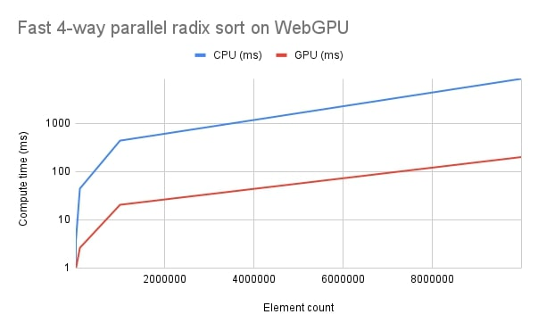

# Fast 4-way parallel radix sort for WebGPU

[](https://badge.fury.io/js/webgpu-radix-sort)

This is a WebGPU implementation for the radix sort algorithm as described in the paper [Fast 4-way parallel radix sorting on GPUs](https://www.sci.utah.edu/~csilva/papers/cgf.pdf).

- Sort large arrays on GPU using WGSL compute shaders
- Supports 32-bit unsigned integers (`Uint32Array`)
- Supports 32-bit unsigned floating points (`Float32Array`)
- Sort a buffer of `keys` and associated `values` at the same time. The sort is made based on the `keys` buffer.
- Includes "Order Checking" optimization to exit early if the input is already sorted. This can improve real-time performances in the case the input doesn't change much between frames.
- Supports arrays of arbitrary size

#### Use Cases:
- Sort data exclusively on the GPU
- Sort a large number of elements (> 100,000 elements) faster than the CPU
- Sort a large number of elements in real-time applications

### Parallel Prefix Sum (Scan)

This algorithm relies on another widely used parallel algorithm called the prefix sum (or scan).

Thus, this repository also contains a WebGPU implementation of the method described in the following publication: [Parallel Prefix Sum (Scan) with CUDA](https://www.eecs.umich.edu/courses/eecs570/hw/parprefix.pdf).

- Includes the "Work Efficient Parallel Scan" optimization
- Recurses on itself until the input fits one workgroup
- Supports arrays of arbitrary size

## Demo

https://kishimisu.github.io/WebGPU-Radix-Sort/

## Installation
### Using npm
```bash
npm install webgpu-radix-sort
```

### Using a \<script\> tag
```html
<!-- From source -->
<script src="./dist/umd/radix-sort-umd.js"></script>
<!-- From CDN -->
<script src="https://cdn.jsdelivr.net/npm/webgpu-radix-sort@1.0.7/dist/umd/radix-sort-umd.js"></script>
<script>
    const { RadixSortKernel } = RadixSort;
</script>
```

### Using a \<script type="module"\> tag
```html
<script type="module">
    // From source
    import { RadixSortKernel } from './dist/esm/radix-sort-esm.js';
    // From CDN
    import { RadixSortKernel } from 'https://cdn.jsdelivr.net/npm/webgpu-radix-sort@1.0.7/dist/esm/radix-sort-esm.js';
</script>
```
## Usage
```javascript
import { RadixSortKernel } from 'webgpu-radix-sort';

// Create GPU device
const adapter = await navigator.gpu?.requestAdapter()
const device = await adapter?.requestDevice()

// Create GPU buffers
const keysBuffer = device.createBuffer({ ... })   // keys must be unsigned (>= 0)
const valuesBuffer = device.createBuffer({ ... }) // values can be any type

// Create radix sort kernel    
const radixSortKernel = new RadixSortKernel({
    device: device,                   // GPUDevice to use
    keys: keysBuffer,                 // GPUBuffer containing the keys to sort
    values: valuesBuffer,             // (optional) GPUBuffer containing the associated values
    count: keys.length,               // Number of elements to sort
    check_order: false,               // Whether to check if the input is already sorted to exit early
    bit_count: 32,                    // Number of bits per element. Must be a multiple of 4 (default: 32)
    workgroup_size: { x: 16, y: 16 }, // Workgroup size in x and y dimensions. (x * y) must be a power of two
})

// Create CommandEncoder and ComputePass
const encoder = device.createCommandEncoder()
const pass = encoder.beginComputePass()

radixSortKernel.dispatch(pass) // Sort keysBuffer and valuesBuffer in-place on the GPU

pass.end()
device.queue.submit([encoder.finish()])
```

### Current limitations

- Sort in ascending order
- Only supports unsigned values for the keys buffer
- The elements in the keys and values buffers must be aligned to 4 bytes
- `bit_count` must be a multiple of 4
- `workgroup_size.x * workgroup_size.y` must be a power of two

### Maximum number of elements

The maximum number of elements that can be processed is not bound by the implementation itself but by WebGPU limits, which can be increased when creating the GPUDevice. 

If you encounter warnings when creating or dispatching the radix sort kernel, try increasing the relevant limits:
- `maxBufferSize` (default: 268,435,456, limiting the number of elements to 67,108,864)
- `maxStorageBufferBindingSize` (default: 134,217,728, limiting the number of elements to 33,554,432)

You should also take the following limits into consideration when choosing the `workgroup_size` parameter:

- `maxComputeWorkgroupSizeX` (default: 256) ⟺ workgroup_size.x
- `maxComputeWorkgroupSizeY` (default: 256) ⟺ workgroup_size.y
- `maxComputeInvocationsPerWorkgroup` (default: 256) ⟺ workgroup_size.x * workgroup_size.y

## Performance Tests

The following tests were done on a laptop using an Intel Core i9 @ 2.90GHz (CPU) and a NVIDIA RTX 3080TI (GPU). The vertical axis is logarithmic.



## Implementation detalis

### 1) Fast 4-way parallel radix sort

#### Local shuffling and coalesced mapping

In the original paper, a section describes how the data is locally shuffled (sorted) within the workgroups before computing the prefix block sum. This is done in order to address the issue of non-coalseced writing on the global memory.
By sorting the input data locally, it improves the memory read/write patterns during the final reordering step, resulting in a 36% performance increase in the original paper.
However, adding this process to my WebGPU implementation didn't seem to have such an impact on the performance. This can be explained by the fact that this paper was designed for an old version of CUDA (2009) and graphics card architectures have evolved since, being more optimized "out of the box" today.
For this reason, this process is disabled by default, but it can be enabled with the parameter `local_shuffle`.

#### Order checking

To improve performance in cases where the input data is already sorted or nearly sorted, the original paper describes a method that will initially scan the input array before each pass of the algorithm. In the case where the input array is sorted, the algorithm will exit early and prevent unecessary calculations. This can be useful if the data is sorted every frame with few changes between each frame for instance.

After a few attempts, I managed to implement a version of this check that seem to improve the performance in the case the where the array is already sorted, or when it gets sorted before all the passes finishes.
This optimization can be enabled with the `check_order` parameter.

Here's a short explanation on how it works:

First, I changed the entire dispatching process to use indirect buffers with `dispatchWorkgroupsIndirect` instead of passing the size from the CPU via `dispatchWorkgroups`. This way, I can dynamically change the number of workgroups dispatched for each pipeline directly from the GPU. I noticed however that for the exact same dispatch size, using `dispatchWorkgroupsIndirect` was slightly slower than `dispatchWorkgroups`, so I make use of indirect buffers only when the order checking optimization is enabled.

Then, I created a custom `CheckSortKernel` that performs a parallel reduction on the input array to check if it is sorted, and update relevant dispatch buffers accordingly.
To follow the original paper idea, I created two versions of this kernel: a fast one that checks only a small part of the array, and a full one that checks the remaining elements.
When this optimization is enabled, these two kernels are dispatched every 2 pass before the radix sort pipelines, and will effectively stop the execution of the algorithm if the array is sorted:


1. CheckSortKernel (fast):
    - Check for a small part of the array to see if it is sorted (by default this kernel only creates 4 workgroups, so 1024 elements are checked)
    - If this region isn't sorted, skip the full check (zero out the full check dispatch buffer)
    - If this region is sorted, run the full check (revert the full check dispatch buffer)

2. CheckSortKernel (full):
    - Check the remaining elements to see if they are sorted
    - If the array is sorted, skip the radix sort (zero out the radix sort dispatch buffer) and set a flag in a specific buffer that will skip any further passes
    - If the array isn't sorted, run the radix sort (revert the radix sort dispatch buffer)

3. RadixSortKernel
    - The radix sort kernel will now run conditionally based on the result of the check sort kernels

### 2) Parallel Prefix Sum with CUDA

#### Avoiding Bank Conflicts

In the original publication, the final version of the algorithm contains an optimization that aims at improving shared memory access patterns in order to reduce bank conflicts. 
Bank conflicts happen when multiple threads are accessing the same memory bank at the same time, resulting in slower sequential processing.
To fix this issue, the authors introduced a macro that offsets every shared memory access within their algorithm in a clever way such that the bank conflics are minimized.
Similar to the above note on `Local shuffling and coalesced mapping`, this algorithm was designed for 2007-ish versions of CUDA and adding it to my WebGPU implementation didn't seem to have an impact on the performance.
It's disabled by default but can be enabled using the `avoid_bank_conflicts` parameter.

## Project structure

```
.
├── index.html                          # Demo page for performance profiling
├── example
│   ├── index.js                        # Demo page entry point
│   ├── tests.js                        # Utilities for testing
│
├── dist                                # Build output
│   ├── cjs                             # CommonJS build
│   ├── esm                             # ES Module build
│   ├── umd                             # UMD build (Universal Module Definition)
│
├── src                                 # Source code
│   ├── RadixSortKernel.js              # 4-way Radix Sort kernel definition
│   ├── PrefixSumKernel.js              # Parallel Prefix Sum kernel definition
│   ├── CheckSortKernel.js              # Order checking kernel definition
│   │   
│   ├── shaders                         # WGSL shader sources as javascript strings
│       ├── radix_sort.js               # Compute local prefix sums and block sums
│       ├── radix_sort_reorder.js       # Reorder data to sorted position
│       ├── prefix_sum.js               # Parallel Prefix Sum (scan) algorithm  
│       ├── check_sort.js               # Parallel Order Checking reduction 
│       │
│       ├── optimizations               # Contains shaders including optimizations (see "Implementation" section)
│           ├── radix_sort_local_shuffle.js
│           ├── prefix_sum_no_bank_conflict.js      
```

## References

- [Fast 4-way parallel radix sorting on GPUs](https://www.sci.utah.edu/~csilva/papers/cgf.pdf)
- [Parallel Prefix Sum (Scan) with CUDA](https://www.eecs.umich.edu/courses/eecs570/hw/parprefix.pdf)